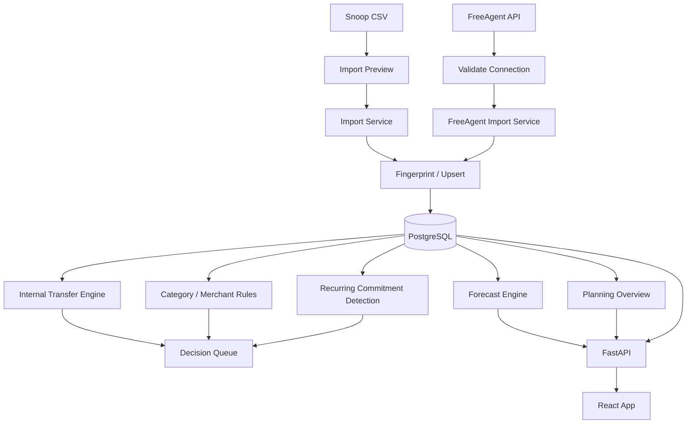

<!---
ai-eos-metadata:
  purpose: "High-level architecture design, component relationships, and data flows."
  how_to_use: "Consult before implementing features to ensure structural alignment."
  generated_by: "Manual Genesis-aligned bootstrap"
--->

# Architecture Design - Personal Finance Studio

**Last reviewed:** 2026-06-15  
**Implementation status:** Phase 2 household expansion, FreeAgent paginated OAuth import, overdraft-aware cash semantics, and dashboard personalization are implemented locally.

## 1. System Overview

Personal Finance Studio is planned as a local-first web application:

- React + Vite frontend for the user interface.
- FastAPI backend for import, finance logic, forecasts, and APIs.
- PostgreSQL database for durable local storage.
- Docker Compose for local development and database runtime.

Phase 1/2 currently has one active entity, Household, populated by Snoop CSV imports and optional read-only FreeAgent bank transaction imports. Phase 2 stays household-focused and adds rule application, merchant cleanup, scenario planning, budget control-tower workflows, cash-constrained spending-plan views, dashboard widgets, and exports. Business entity imports from Tide/NatWest Business are now Phase 2.1 so household expansion can remain coherent.

## 2. Key Components

- **Frontend App**: React, TypeScript, route-based screens, design system, charts, tables, calendar/timeline views, and `dnd-kit` sortable dashboard widgets.
- **Frontend App Status**: `frontend/src/App.tsx` currently owns the hash-route shell, topbar date controls, dashboard cards/widgets, shared contextual help tooltips, account review, transaction filters/table, cashflow, calendar/upcoming, recurring, goals, Budget Control Tower workflow, budget modes/rollovers, safe-spend assumptions, sinking funds, monthly review, subscriptions, reports/exports, first-run import personalization, import center, Decision Queue, FreeAgent import UI, and Settings UI.
- **Backend API**: FastAPI endpoints for imports, accounts, transactions, transfers, commitments, calendar, forecasts, dashboards, insights, planning, and decisions.
- **Import Service**: Snoop CSV parser, validator, previewer, fingerprinting/upsert engine, import logs.
- **Classification Service**: account type mapping, category normalization, merchant rules, reviewed/unreviewed state.
- **Internal Transfer Engine**: same/similar amount matching, opposite-sign reconciliation, description/account pattern detection.
- **Commitment Engine**: recurring bill detection, transaction-backed commitment creation with household reference names/categories, manual commitment entry, subscription candidates, variable bill estimates, finite BNPL/loan/payment-plan modeling, and credit-card obligation modeling.
- **Forecast Engine**: projected balances, available-after-commitments, flexible spending remaining, low-balance warnings.
- **Account Balance Semantics**: centralized `available_for_bills` and `liability_balance` calculations so overdraft-enabled current accounts can contribute bill-payment capacity while still reporting negative balances as liabilities.
- **Decision Queue**: low-noise human confirmations that improve accuracy; rendered as a compact desktop review table and mobile action cards.
- **Planning Overview Service**: deterministic Phase 1.5 aggregation for goals, sinking funds, monthly review, subscription prompts, saved filters, import freshness, and stale commitments.
- **FreeAgent Integration Services**: encrypted local credentials, OAuth authorization-code exchange, automatic access-token refresh, API validation, bank account listing, paginated date-range/incremental bank transaction import, and provider-specific dedupe.
- **Secret Store**: Fernet-style local encryption key file and encrypted database fields for client secrets and OAuth tokens; tokens are never shown unmasked in the UI by default.
- **Database**: PostgreSQL tables for entities, profiles, accounts, transactions, rules, bills, instances, and imports; Phase 1.75/2 user-authored planning preferences are currently browser-local except explicit transaction review/rule application mutations.

## 3. Data Flow

## 4. Key Constraints & Tech Stack

- **Frontend**: React + Vite + TypeScript.
- **Routing**: Lightweight hash routes for Phase 1 (`#/dashboard`, `#/accounts`, etc.); upgrade to a router library only when nested flows need it.
- **Data Fetching**: Plain typed `fetch` client in `frontend/src/api.ts` for Phase 1; TanStack Query remains optional for later cache-heavy flows.
- **Styling**: CSS variables and hand-authored CSS in `frontend/src/styles.css`.
- **Motion & DnD**: `@dnd-kit/*` for dashboard widget sorting and `@formkit/auto-animate` for low-risk list/collapsible transitions.
- **Charts**: Lightweight SVG/CSS for Phase 1; Recharts or Visx remain optional if richer chart interactions are needed.
- **Backend**: FastAPI, Pydantic, SQLAlchemy, Alembic.
- **Database**: PostgreSQL.
- **Runtime**: Docker Compose for Postgres; local backend/frontend dev servers.
- **Phase 1 Integration**: Snoop CSV only.

## 5. Implemented Route/API Surface

Frontend routes:

- `#/dashboard`
- `#/accounts`
- `#/transactions`
- `#/cash-flow`
- `#/calendar`
- `#/budget`
- `#/recurring`
- `#/goals`
- `#/sinking-funds`
- `#/monthly-review`
- `#/subscriptions`
- `#/reports`
- `#/decision-queue`
- `#/freeagent`
- `#/import`
- `#/settings`

Backend APIs:

- `GET /health`
- `POST /api/imports/snoop/preview`
- `POST /api/imports/snoop/commit`
- `POST /api/imports/reset`
- `GET/PATCH /api/accounts`
- `GET/PATCH /api/transactions`
- `POST/GET /api/transfers`
- `POST/GET/PATCH /api/commitments`
- `POST /api/commitments/instances/{id}/mark-paid`
- `GET /api/calendar/upcoming`
- `GET /api/forecast`
- `GET /api/dashboard`
- `GET /api/insights`
- `GET /api/planning/overview`
- `GET/POST /api/decisions`
- `GET /api/integrations/freeagent/status`
- `POST /api/integrations/freeagent/credentials`
- `POST /api/integrations/freeagent/validate`
- `GET /api/integrations/freeagent/bank-accounts`
- `POST /api/integrations/freeagent/import`

Phase 2 additions should preserve this simple API style. Mutating workflows such as rule application
must expose preview, commit, and undo/reversal concepts rather than silently rewriting imported data.
Reset workflows must be explicit, destructive, and limited to imported/local finance data so defaults
and app code remain intact while demos or bad imports can be cleared.

## 6. Architecture Principles

- Entity scope is mandatory: Household and Business data must not cross-contaminate.
- App calculations are deterministic; future LLM features may explain results but should not calculate money.
- Imported files are parsed and discarded by default; import logs and normalized records are retained.
- Transfers are first-class records, not category hacks.
- Forecasts must distinguish actual, estimated, forecast, and pending values.
- Cash Position means account/overdraft capacity today; Spending Plan means period evidence and assumptions. Dashboard must not present period surplus as spendable cash without a cash cap.
- Budget uses a control-tower workflow: show the spend boundary first, then separate monthly plan, envelopes, assumptions, and review. This follows decision-psychology principles from envelope budgeting, Kakeibo reflection, guardrail budgeting, and mental accounting.
- Recurring commitments use a commitment-inbox model: detection suggests, humans confirm, manual entry covers missed bills, and finite plans prevent BNPL/short-term obligations from recurring forever.
- Dashboard personalization is a user preference. Widget order, visibility, and custom widgets are local-first until server-backed preferences are introduced.
