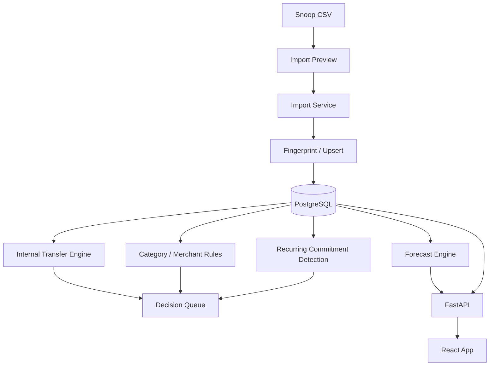

<!---
ai-eos-metadata:
  purpose: "High-level architecture design, component relationships, and data flows."
  how_to_use: "Consult before implementing features to ensure structural alignment."
  generated_by: "Manual Genesis-aligned bootstrap"
--->

# Architecture Design - Personal Finance Studio

**Last reviewed:** 2026-06-14  
**Implementation status:** Phase 1 local implementation exists.

## 1. System Overview

Personal Finance Studio is planned as a local-first web application:

- React + Vite frontend for the user interface.
- FastAPI backend for import, finance logic, forecasts, and APIs.
- PostgreSQL database for durable local storage.
- Docker Compose for local development and database runtime.

Phase 1 currently has one active entity, Household, populated by Snoop CSV imports. The architecture remains ready for Business entity imports from Tide/NatWest Business later.

## 2. Key Components

- **Frontend App**: React, TypeScript, route-based screens, design system, charts, tables, calendar/timeline views.
- **Frontend App Status**: `frontend/src/App.tsx` currently owns the hash-route shell, topbar date controls, dashboard cards, account review, transaction filters/table, cashflow, calendar/upcoming, recurring, reports, and Decision Queue UI.
- **Backend API**: FastAPI endpoints for imports, accounts, transactions, transfers, commitments, calendar, forecasts, dashboards, insights, and decisions.
- **Import Service**: Snoop CSV parser, validator, previewer, fingerprinting/upsert engine, import logs.
- **Classification Service**: account type mapping, category normalization, merchant rules, reviewed/unreviewed state.
- **Internal Transfer Engine**: same/similar amount matching, opposite-sign reconciliation, description/account pattern detection.
- **Commitment Engine**: recurring bill detection, subscription candidates, variable bill estimates, BNPL/loan/credit-card obligation modeling.
- **Forecast Engine**: projected balances, available-after-commitments, flexible spending remaining, low-balance warnings.
- **Decision Queue**: low-noise human confirmations that improve accuracy; rendered as a compact desktop review table and mobile action cards.
- **Database**: PostgreSQL tables for entities, profiles, accounts, transactions, rules, bills, instances, imports, goals-ready schema.

## 3. Data Flow

## 4. Key Constraints & Tech Stack

- **Frontend**: React + Vite + TypeScript.
- **Routing**: Lightweight hash routes for Phase 1 (`#/dashboard`, `#/accounts`, etc.); upgrade to a router library only when nested flows need it.
- **Data Fetching**: Plain typed `fetch` client in `frontend/src/api.ts` for Phase 1; TanStack Query remains optional for later cache-heavy flows.
- **Styling**: CSS variables and hand-authored CSS in `frontend/src/styles.css`.
- **Charts**: Lightweight SVG/CSS for Phase 1; Recharts or Visx remain optional if richer chart interactions are needed.
- **Backend**: FastAPI, Pydantic, SQLAlchemy, Alembic.
- **Database**: PostgreSQL.
- **Runtime**: Docker Compose for Postgres; local backend/frontend dev servers.
- **Phase 1 Integration**: Snoop CSV only.

## 5. Implemented Route/API Surface

Frontend routes:

- `#/dashboard`
- `#/accounts`
- `#/transactions`
- `#/cash-flow`
- `#/calendar`
- `#/recurring`
- `#/reports`
- `#/decision-queue`

Backend APIs:

- `GET /health`
- `POST /api/imports/snoop/preview`
- `POST /api/imports/snoop/commit`
- `GET/PATCH /api/accounts`
- `GET/PATCH /api/transactions`
- `POST/GET /api/transfers`
- `POST/GET/PATCH /api/commitments`
- `POST /api/commitments/instances/{id}/mark-paid`
- `GET /api/calendar/upcoming`
- `GET /api/forecast`
- `GET /api/dashboard`
- `GET /api/insights`
- `GET/POST /api/decisions`

## 6. Architecture Principles

- Entity scope is mandatory: Household and Business data must not cross-contaminate.
- App calculations are deterministic; future LLM features may explain results but should not calculate money.
- Imported files are parsed and discarded by default; import logs and normalized records are retained.
- Transfers are first-class records, not category hacks.
- Forecasts must distinguish actual, estimated, forecast, and pending values.
