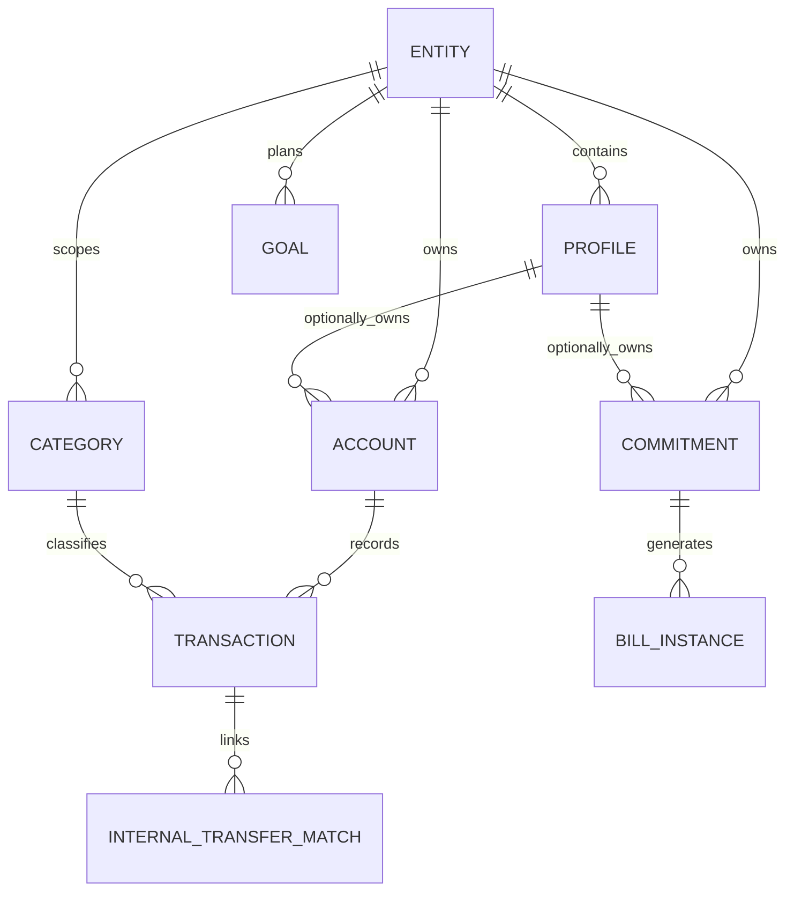

<!---
ai-eos-metadata:
  purpose: "Core business entities, relationships, validation rules, and state machines."
  how_to_use: "Consult to ensure domain logic alignment, correct vocabulary, and status transitions."
  generated_by: "Manual Genesis-aligned bootstrap"
--->

# Domain Model - Personal Finance Studio

## 1. Domain Glossary

- **Entity**: A separate financial universe, such as Household or Business.
- **Profile**: A person or role inside an entity, such as primary user, spouse, child, or director.
- **Account**: A bank account, savings pot, credit card, loan, BNPL account, or other financial container.
- **Transaction**: Imported or manually entered money movement.
- **Internal Transfer**: Movement between owned accounts that should not count as spending or income.
- **Commitment**: A recurring or planned obligation, such as bill, subscription, credit-card payment, loan payment, BNPL installment, or annual cost.
- **Bill Instance**: A dated occurrence of a commitment.
- **Flexible Spend**: Money available for variable categories such as groceries, eating out, shopping, fuel, and adhoc spending.
- **Sinking Fund**: Money set aside over time for non-monthly costs such as car insurance, school costs, Christmas, MOT, or annual subscriptions.
- **Decision Queue**: A small list of high-impact confirmations that improve forecast accuracy.

## 2. Core Entities

### Entity

- `id`
- `name`
- `type`: `household` or `business`
- `status`: `active`, `archived`

### Profile

- `id`
- `entity_id`
- `name`
- `role`
- `status`

### Account

- `id`
- `entity_id`
- `profile_id` nullable
- `provider`
- `display_name`
- `source_account_name`
- `account_type`: `current`, `savings`, `pot`, `credit_card`, `loan`, `bnpl`, `unknown`
- `current_balance`
- `balance_as_of`
- `include_in_cash_on_hand`
- `include_in_forecast`
- `status`

### Transaction

- `id`
- `entity_id`
- `account_id`
- `date`
- `merchant_name`
- `description`
- `amount`
- `direction`: `inflow`, `outflow`
- `source_category`
- `normalized_category_id`
- `status`: `posted`, `pending`
- `reviewed`
- `transaction_type`: `spending`, `income`, `internal_transfer`, `debt_payment`, `refund`, `ignored`, `needs_review`
- `fingerprint`
- `import_id`

### Category

- `id`
- `entity_id` nullable
- `entity_type`: `household`, `business`, `both`
- `name`
- `category_group`: `fixed`, `flexible`, `non_monthly`, `income`, `debt`, `transfer`, `ignored`
- `excluded_from_spending`

### Internal Transfer Match

- `id`
- `entity_id`
- `from_transaction_id`
- `to_transaction_id`
- `confidence`
- `status`: `candidate`, `confirmed`, `rejected`
- `reason`

### Commitment

- `id`
- `entity_id`
- `owner_profile_id` nullable
- `shared_scope`: `household`, `profile`, `business`
- `name`
- `commitment_type`: `bill`, `subscription`, `loan_payment`, `credit_card_payment`, `bnpl_installment`, `income`, `sinking_fund`, `one_off`
- `frequency`: `weekly`, `monthly`, `quarterly`, `annual`, `custom`, `one_off`
- `expected_amount`
- `estimate_method`
- `next_due_date`
- `source`
- `status`

### Bill Instance

- `id`
- `commitment_id`
- `entity_id`
- `due_date`
- `expected_amount`
- `estimated_amount`
- `actual_amount`
- `paid_date`
- `paid_account_id`
- `status`: `planned`, `due_soon`, `paid`, `overdue`, `skipped`, `partially_paid`, `needs_review`
- `matched_transaction_id` nullable

### Goal

Reserved in Phase 1 data model, full UI later.

- `id`
- `entity_id`
- `profile_id` nullable
- `name`
- `goal_type`: `savings`, `debt_payoff`, `sinking_fund`, `custom`
- `target_amount`
- `target_date`
- `linked_account_id` nullable
- `linked_category_id` nullable
- `current_amount`
- `status`

## 3. Relationships

## 4. Business Rules

- Every financial object must belong to exactly one entity.
- Profiles are optional owners; entity ownership is mandatory.
- Household-level bills should use `owner_profile_id = null` and `shared_scope = household`.
- Credit limits are not available money.
- Loans and BNPL are liabilities, not cash.
- Internal transfers are excluded from spending and income reports but remain visible in account history.
- Available money must distinguish cash on hand from available after commitments.
- Variable commitments must retain actual payment history and show estimates as estimates.
- Annual and irregular commitments must be supported for sinking-fund planning.
